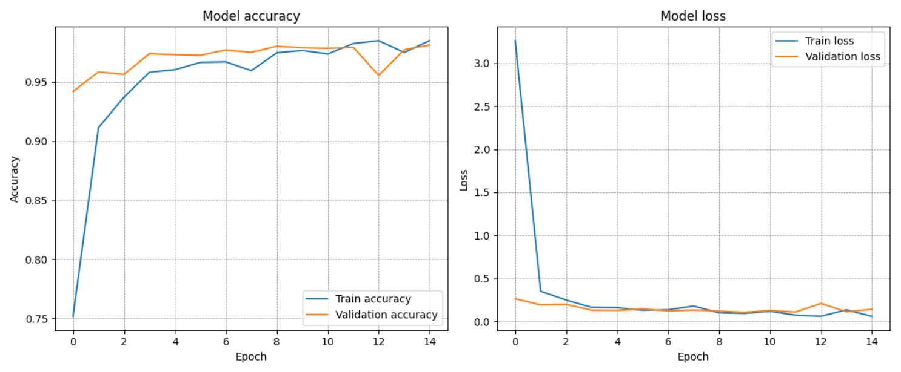
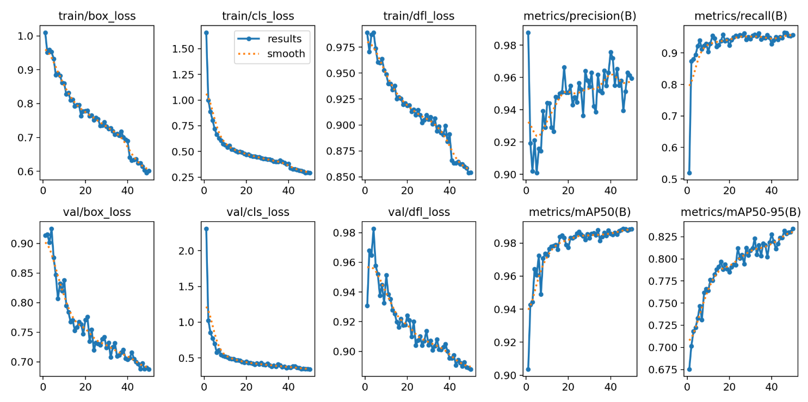

# Projekt zaliczeniowy - Inteligencja obliczeniowa  
**Temat projektu:** Aplikacja to wykrywania i klasyfikacji znaków drogowych na podstawie zdjęć.  

## OPIS APLIKACJI  
### Co zostało wykorzystane?  
Aplikacja skłąda się z dwóch mikroserwisów:
- frontend - aplikacja React działająca na porcie 5173
- backend - aplikaja Flask działająca na porcie 5000

### Jakie modele zostały wykorzystane?  
Aplikacja korzysta z **dwóch** modeli **konwolucyjnych sieci neuronowych**:
1. Detektor - odpowiada za wykrycie znaków drogowych na zdjęciu
2. Klasyfikator - odpowiada za przypisanie klasy do każdego wykrytego znaku drogowego

### Schemat działania aplikacji  
1. Użytkownik wybiera zdjęcie ze swojego urządzenia i zatwierdza wybór.
2. Po zatwierdzeniu, zdjęcie jest wysyłane do backendu, który zajmuje się analizą zdjęcia.
3. Po zakończeniu analizy backend wysyła do frontendua zdjęcie z naniesionymi ramkami wokół wykrytych znaków oraz listę wykrytych klas znaków drogowych.

## Lista rozpoznawanych znaków drogowych  
Aplikacja jest w stanie rozpoznać łącznie **50** klas polskich znaków drogowych.  
Znaki ostrzegawcze: A1, A2, A3, A4, A6-a, A6-b, A6-c, A6-d, A6-e, A7, A11-a A12, A16, A17, A18-b, A21, A29, A30, A32  
Znaki zakazu: B1, B2, B5, B20, B21, B22, B23, B25, B26, B33, B36, B41  
Znaki nakazu: C2, C4, C5, C9, C10, C12  
Znaki informacyjne: D1, D2, D3, D4-a, D6, D6-b, D15, D18, D23, D28, D29, D42, D43  

## Preprocessing obrazów  
### Obrazy do klasyfikatora  
Obrazy dla modelu klasyfikatora zostały podzielone na 3 zestawy:
- zestaw treningowy (50 klas po 512 obrazów)
- zestaw walidacyjny (50 klas po 128 obrazów)
- zestaw testowy (50 klas po 128 obrazów)

Do niektórych klas brakowało zdjęć, więc aby nadrobić braki użyto technik **augmentacji** w celu sztucznego zwiększenia ilości obrazów.  
Użyte techniki augmentacji:
- zmiana jasności i kontrastu
- rozmycie obrazu
- zmiana lokalnego kontrastu (uwypuklenie szczegółów w ciemnych lub prześwietlonych miejscach)
- zmiana barwy, nasycenia i jasności koloru
- dodanie szumu

### Obrazy do detektora  
Obrazy i ich etykiety do modelu detektora zostały podzielone na 3 zestawy:
- zestaw treningowy (1212 obrazów i etykiet)
- zestaw walidacyjny (303 obrazy i etykiety)
- zestaw testowy (45 obrazów)

## Model klasyfikatora  
### Opis modelu
Do modelu klasyfikatora znaków drogowych użyto **konwolucyjnej sieci neuronowej** o nastepującej budowie:  

|Nr|Warstwa          |Parametry                     |Aktywacja  |
|--|-----------------|------------------------------|-----------|
|1 |Input            |shape: (224, 224, 3)          |-          |
|2 |Conv2D           |filters: 32, kernel_size: 3x3 |ReLU       |
|3 |MaxPooling2D     |pool_size: 2x2                |-          |
|4 |Conv2D           |filters: 64, kernel_size: 3x3 |ReLU       |
|5 |MaxPooling2D     |pool_size: 2x2                |-          |
|6 |Conv2D           |filters: 128, kernel_size: 3x3|ReLU       |
|7 |MaxPooling2D     |pool_size: 2x2                |-          |
|8 |Flatten          |-                             |-          |
|9 |Dense            |units: 512                    |ReLU       |
|10|Dropout          |rate: 0.5                     |-          |
|11|Dense (wyjściowa)|units: 50                     |Softmax    |

Do modelu użyto optymalizatowa **Adam**.  
Do uczenia zostały utworzone 2 checkpointy:
- Checkpoint `EarlyStopping` monitoruje stratę walidacyjną (`val_loss`) i jeżeli parametr się nie poprawi przez 5 epok, to model kończy uczenie.
- Checkpoint `ModelCheckpoint` monitoruje wydajność walidacyjną (`val_accuracy`) i zapisuje wersję modelu, który posiadał najwyższy ten parametr.

### Wynik treningu
Model był docelowo trenowany na 100 epok, lecz trening skończył się już po 15 epokach.  
Wyniki uczenia przedstawiono na wykresie.  

Wyjasnienie parametrów:
- **Train accuracy** - skuteczność modelu podczas treningu
- **Validation accuracy** - skuteczność modelu podczas walidacji
- **Train loss** - strata modelu podczas treningu
- **Validation loss** - strata modelu podczas walidacji

Na przedstawionych danych widać, że model niemalże od razu osiągnął skuteczność na poziomie ponad **90%**, a po 15 epoce wyniosła **98%**!

## Model detektora  
### Opis modelu  
Do modelu detektora użyto **konwolucyjnej sieci neuronowej** opartej na algorytmie **YOLO** (You Only Look Once). Do utworzenia modelu wykorzystano technikę **Transfer learning**, czyli na podstawie gotowego modelu **YOLO** w wersji 8, przeprowadzono trening na obrazach przedstawiających znaki drogowe wraz z otoczeniem. Podczas treningu, model wykonywał augmentację zdjęć w celu lepszej nauki.

### Opis algorytmu YOLO (You Only Look Once)
Algorytm YOLO zajmuje się wykrywaniem obiektów na obrazach. Jego główną zaletą jest to, że widzi cały obraz naraz i od razu jest w stanie powiedzieć gdzie znajdują się szukane obiekty, jakie są ich rozmiary oraz co to są za obiekty. Każdy obraz posiada swoje etykiety w postaci: `<id-klasy> <x-centrum> <y-centrum> <szerokość> <wysokość>`.  
Parametr `id-klasy` jest liczbą nautralną, a pozostałe parametry są liczbami rzeczywistymi od 0.0 do 1.0.  

Schemat działania algorytmu:
1. Obraz trafia do modelu YOLO.
2. Obraz jest w całości przetwarzany przez konwolucyjną sieć neuronową.
3. Na wyjściu zwracana jest siatka (np. 13x13) i w każdej kratce model przewiduje:
    - **współrzędne prostokąta** (x, y, szerokość, wysokość)
    - **współczynnik pewności** (jak bardzo model jest pewien, że jakiś obiekt istnieje w kratce)
    - **klasa obiektu**
4. Funkcja straty porównuje te prognozy z prawdziwymi danymi podczas uczenia.
5. Model uczy się na błędach i poprawia swoje wagi w sieci.
6. Model usuwa nadmiar ramek i zostawia te, które osiągneły najlepszy wynik.

### Wyniki treningu  
Wyniki treningu na 50 epokach pokazano na wykresie.  

Wyjaśnienie parametrów:
- **box_loss** - błąd dopasowania ramek
- **cls_loss** - błąd klasyfikacji obietków
- **dfl_loss** - błąd dokładności pozycjonowania ramek
- **metrics/precision** - procent poprawnych wykryć spośród wszystkich predykcji (TP / (TP + FP))
- **metrics/recall** - procent wykrytych obiektów spośród wszystkich rzeczywistych (TP / (TP + FN))
- **metrics/mAP50** - średnia nakładania się ramek przewidywanych i prawdziwych dla progu IoU (Intersection over Union) na poziomie 50%
- **metrics/mAP50-95** - średnia z 10 progów IoU od 50% do 95%

Z wykresów wynika, że model z czasem coraz lepiej dopasowywał ramki do znaków drogowych oraz coraz lepiej radził sobie z ich wykrywaniem i klasyfikacją. Ostatecznie model osiągnął skuteczność na poziomie około **90%**.